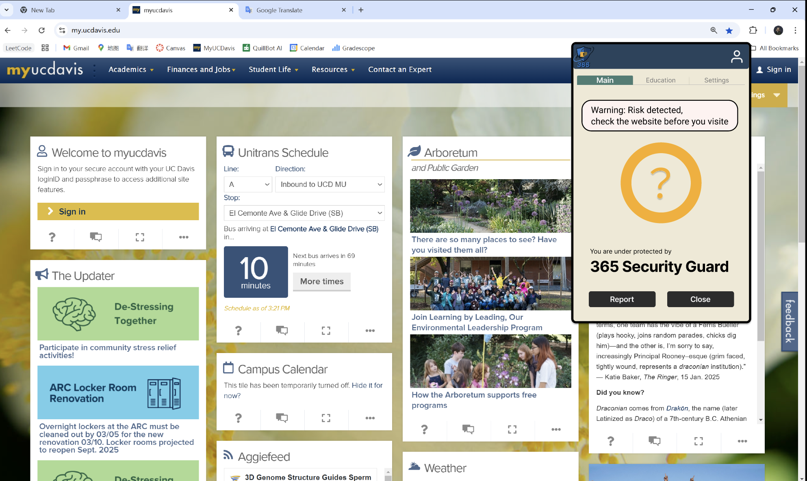

# Human-Computer Interaction (HCI)

 Human-Computer Interaction at UC Davis. This course explores fundamental concepts, methodologies, and practices essential for designing user-centered and effective human-computer interactions.

## Instructor
- **Professor Hao-Chuan Wang**
- **Email:** hciwang@ucdavis.edu

## Course Overview
Human-Computer Interaction (HCI) focuses on placing users at the center of technology design, ensuring interfaces are not just functional but intuitive, enjoyable, and efficient to use.

### Key Goals of HCI Design:
- **Usability:** Systems should be easy to learn, effective to use, and enjoyable.
- **User-Centered:** Engage real users throughout the design process.
- **Iterative:** Continuously refine designs based on feedback and testing.
- **Goal-Oriented:** Clearly defined usability and user experience objectives.

## Core Topics Covered:
### 1. **Introduction to HCI and Design Principles**
- Understanding good vs. bad design examples.
- Visibility, feedback, constraints, logical mappings, and error prevention.

### 2. **Cognitive Foundations**
- How cognitive psychology informs design.
- Concepts such as attention, perception, memory, and mental models.
- Cognitive constraints and strategies to enhance usability.

### 3. **Conceptualizing Interactions**
- Designing usable and useful interactive products.
- Establishing usability goals (effective, efficient, safe, learnable).
- Setting desirable user experience goals (satisfying, enjoyable, motivating).

### 4. **Emotional Design**
- Designing emotionally engaging interactions.
- Understanding visceral, behavioral, and reflective emotional levels.
- Emotional interfaces, persuasive technologies, and anthropomorphism.

### 5. **Personas and User Research**
- Creating personas to represent real user groups.
- Conducting user research through interviews, observations, and contextual inquiries.
- Defining clear user archetypes for targeted design.

## Assignments and Projects:
- **Individual Assignments:** Include analyses of conversational AI products and interface evaluations.
- **Group Project:** Developing a comprehensive design proposal informed by extensive user research, culminating in a prototype and presentation.

## Evaluation and Assessment:
- **Midterm Exam:** Covers conceptual understanding and practical design applications, focusing on usability heuristics, cognitive processes, and interaction design methodologies.
- **Paper Commenting:** Students regularly provide insightful critiques on academic papers.

## Key Methods Used:
- **Heuristic Evaluation:** Assessing usability using established guidelines (e.g., Nielsen's heuristics).
- **Persona Development:** Creating detailed user profiles to guide design decisions.
- **Interview and Observational Methods:** Collecting qualitative data to deeply understand user needs and behaviors.

## Project Images

---

**ECS 164 | Winter 2025 | UC Davis**

